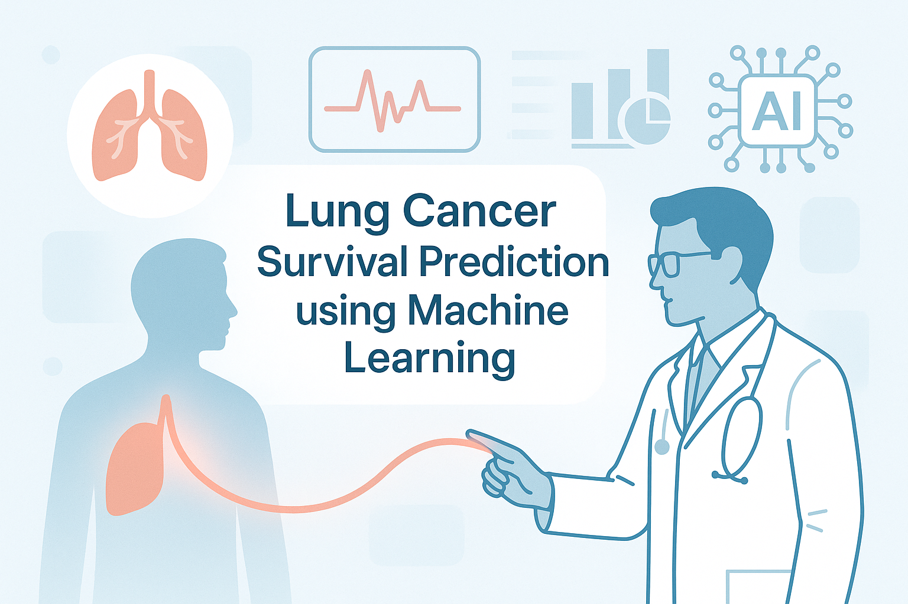
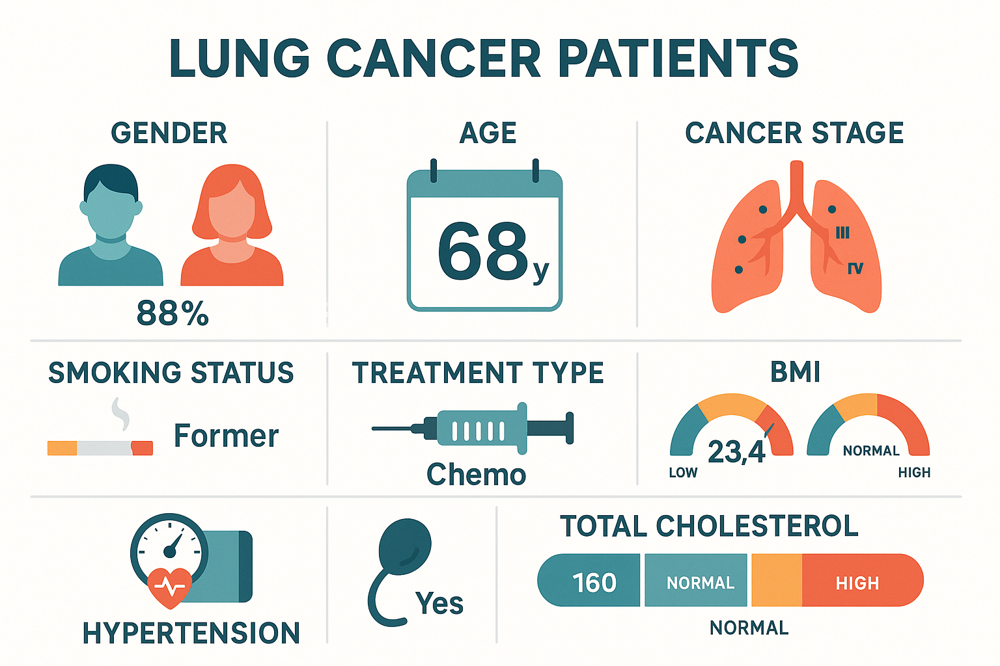
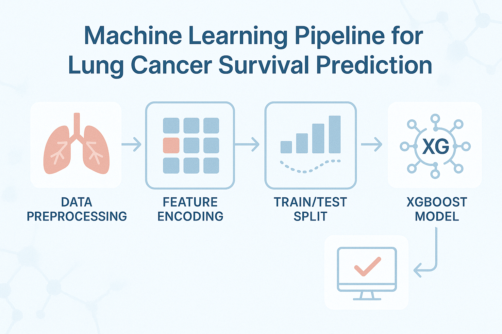
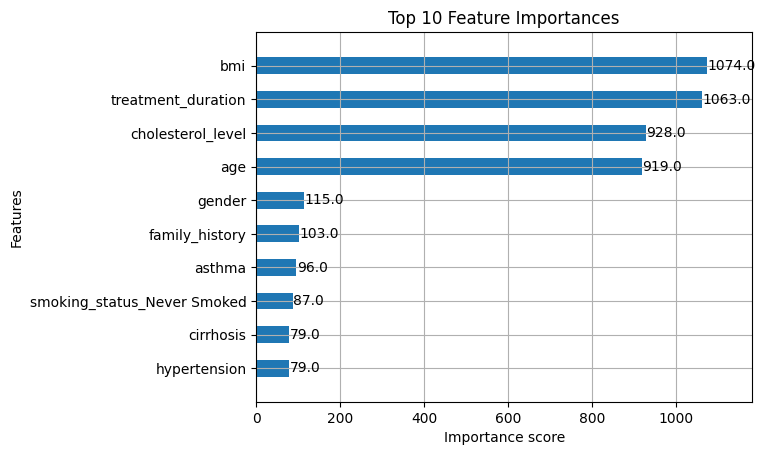
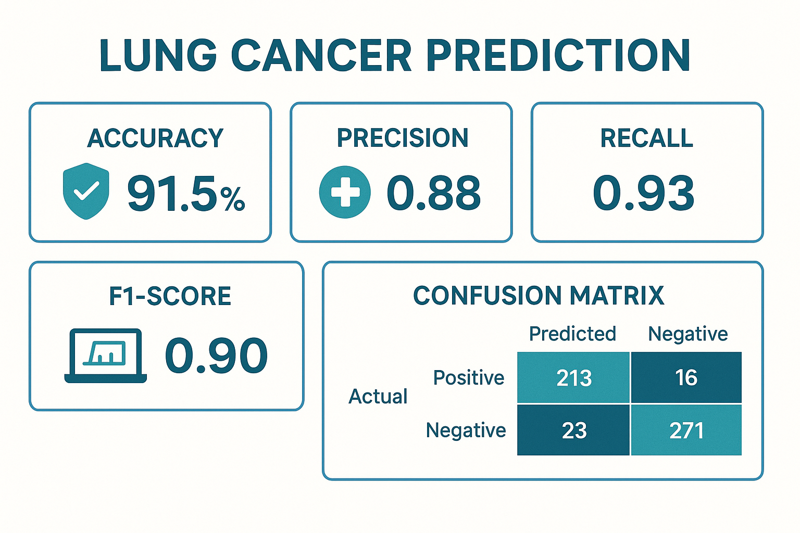

<h1>Lung Cancer Survival Prediction</h1>

This project uses machine learning to predict the survival of lung cancer patients based on medical and demographic data. It was trained on over <strong>890,000 data points</strong> and achieved a training accuracy of <strong>0.77</strong> using the XGBoost classifier.

<h2>📌 Project Description</h2>

Lung cancer is one of the leading causes of cancer-related deaths. Predicting survival outcomes can help guide treatment decisions and resource allocation. This model uses features such as:

<ul>
  <li>Age, Gender</li>
  <li>Cancer Stage</li>
  <li>Cholesterol and BMI</li>
  <li>Smoking Status</li>
  <li>Type of Treatment</li>
  <li>Treatment Duration (calculated from Diagnosis and End Treatment Dates)</li>
</ul>

<h2>📊 Dataset Overview</h2>

The dataset underwent preprocessing steps including:

<ul>
  <li>Dropping irrelevant columns (like <code>ID</code>, <code>Country</code>)</li>
  <li>Encoding categorical features using one-hot encoding</li>
  <li>Calculating treatment duration in days</li>
</ul>

<h2>🧠 ML Workflow</h2>

<ul>
  <li>Data cleaning and preprocessing</li>
  <li>Train-test split</li>
  <li>XGBoost model training</li>
  <li>Model evaluation and feature importance analysis</li>
</ul>

<h2>📈 Feature Importance</h2>

Most important features included:

<ul>
  <li>Cancer Stage</li>
  <li>Type of Treatment</li>
  <li>Treatment Duration</li>
  <li>Age</li>
</ul>

<h2>📉 Model Results</h2>

The XGBoost classifier achieved:

<ul>
  <li>Training Accuracy: <strong>77%</strong></li>
  <li>Robust handling of missing values</li>
  <li>Good generalization with default parameters</li>
</ul>

<h2>🚀 Future Improvements</h2>
<ul>
  <li>Apply cross-validation and hyperparameter tuning</li>
  <li>Integrate model into a web-based application using Streamlit or Flask</li>
  <li>Build an interactive dashboard for healthcare use</li>
</ul>

<h2>👨‍💻 Author</h2>

<strong>Sanskar Gupta</strong> 
Aspiring Data Scientist 
Passionate about solving real-world problems with machine learning and AI

